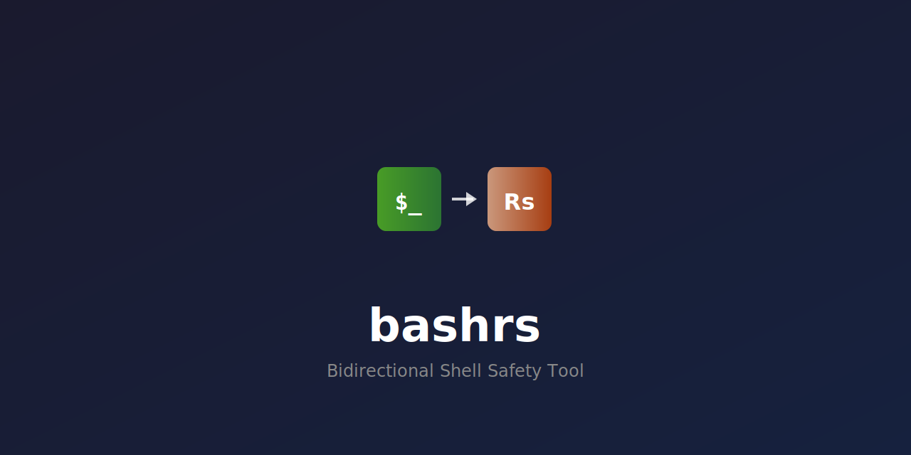

<div align="center">

<p align="center">
  
</p>

<h1 align="center">Rash - Bidirectional Shell Safety Tool</h1>

<p align="center">
  <a href="https://crates.io/crates/bashrs"></a>
  <a href="https://docs.rs/bashrs"></a>
  <a href="https://paiml.github.io/bashrs/"></a>
  <a href="LICENSE"></a>
  <a href="https://github.com/paiml/bashrs/actions"></a>
</p>

<p align="center">
  <b>Bidirectional shell safety tool that purifies legacy bash scripts and lets you write shell scripts in REAL Rust with automatic safety guarantees.</b>
</p>

</div>

## Table of Contents

- [What's New](#-whats-new-in-v6600)
- [Why Rash?](#why-rash)
- [Quick Start](#quick-start)
- [Features](#features)
- [Core Commands](#core-commands)
- [Advanced Testing](#advanced-testing)
- [Documentation](#-documentation)
- [Quality Metrics](#quality-metrics)
- [Shell Compatibility](#shell-compatibility)
- [Performance](#performance)
- [MCP Server](#mcp-server)
- [Contributing](#contributing)
- [License](#license)

## 🚀 What's New in v6.61.0

**Latest Release** - 2026-02-10

- **Transpiler Bug Fixes**: 2 critical correctness fixes
  - `return` inside `while`/`for`/`match` in functions now correctly emits shell arithmetic
  - `let x = match y { ... }` now generates proper `case` statements instead of `x='unknown'`
- **Corpus Expansion**: 14,712 transpilation entries (13,397 Bash + 695 Makefile + 620 Dockerfile)
  - V2 Score: 97.5/100 (A+), 0 failures across all entries
  - 107+ CLI subcommands for corpus analysis, quality gates, and convergence tracking
- **New Example**: `transpiler_demo` showcasing nested calls, match-in-let, recursion, and multi-function programs
- **Quality Metrics**: 10,888 tests, 97.5/100 corpus score (A+)

See [CHANGELOG.md](CHANGELOG.md) for complete release notes.

## Why Rash?

Shell scripts are everywhere—CI/CD pipelines, deployment automation, system configuration—but they're notoriously difficult to write safely. Rash solves this by providing:

1. **Bidirectional Safety**: Write in Rust and transpile to shell, or purify existing bash scripts
2. **Automatic Transformation**: Don't just detect problems—fix them automatically
3. **Deterministic Guarantees**: Same input always produces identical, reproducible output
4. **Zero Runtime Dependencies**: Generated scripts run on any POSIX-compliant system

## Features

- 🛡️ **Automatic Safety**: Protection against shell injection, word splitting, glob expansion
- 🔍 **Beyond Linting**: Full AST semantic understanding - **transforms** code, doesn't just warn
- 📦 **Zero Runtime Dependencies**: Generated scripts work on any POSIX shell
- 🎯 **Deterministic Output**: Same input always produces identical scripts
- ✅ **ShellCheck Compliant**: All output passes strict linting

### How Rash Exceeds ShellCheck

| What ShellCheck Does | What Rash Does |
|---------------------|----------------|
| ⚠️ **Warns**: "$RANDOM is non-deterministic" | ✅ **Rewrites** to version-based deterministic IDs |
| ⚠️ **Warns**: "mkdir may fail if exists" | ✅ **Transforms** to `mkdir -p` (idempotent) |
| ⚠️ **Warns**: "Unquoted variable expansion" | ✅ **Quotes** all variables automatically |
| Static pattern matching | **Full AST semantic understanding** |
| Detects issues (read-only) | **Fixes issues (read-write transformation)** |

**Key Difference**: ShellCheck tells you what's wrong. Rash **understands your code's intent** and rewrites it to be safe, deterministic, and idempotent — automatically.

## Quick Start

### Installation

```bash
# From crates.io (recommended)
cargo install bashrs

# Or from source
git clone https://github.com/paiml/bashrs
cd bashrs
cargo install --path rash
```

### Write Rust, Get Safe Shell

```rust
// install.rs
#[rash::main]
fn main() {
    let version = env_var_or("VERSION", "1.0.0");
    let prefix = env_var_or("PREFIX", "/usr/local");

    echo("Installing MyApp {version} to {prefix}");

    mkdir_p("{prefix}/bin");
    mkdir_p("{prefix}/share/myapp");

    if exec("cp myapp {prefix}/bin/") {
        echo("✓ Binary installed");
    } else {
        eprint("✗ Failed to install binary");
        exit(1);
    }
}
```

**Transpile to safe POSIX shell**:

```bash
$ bashrs build install.rs -o install.sh
```

### Or Purify Existing Bash

**Before** (messy bash):
```bash
#!/bin/bash
SESSION_ID=$RANDOM                      # Non-deterministic
mkdir /app/releases/$RELEASE            # Non-idempotent
rm /app/current                         # Fails if doesn't exist
```

**After** (purified by Rash):
```bash
#!/bin/sh
session_id="session-${version}"         # ✅ Deterministic
mkdir -p "/app/releases/${release}"     # ✅ Idempotent
rm -f "/app/current"                    # ✅ Safe removal
```

## Core Commands

```bash
# Transpile Rust to shell
bashrs build input.rs -o output.sh

# Purify legacy bash scripts
bashrs purify messy.sh -o clean.sh

# Interactive REPL with debugging
bashrs repl

# Lint shell scripts (including Dockerfiles)
bashrs lint script.sh

# Test bash scripts
bashrs test script.sh

# Quality scoring
bashrs score script.sh

# Comprehensive audit
bashrs audit script.sh
```

## Advanced Testing

Rash includes Probar integration for comprehensive quality assurance:

```bash
# State machine testing with playbooks
bashrs playbook install.playbook.yaml --run

# Mutation testing (goal: >90% kill rate)
bashrs mutate script.sh --count 10

# Deterministic simulation replay
bashrs simulate script.sh --seed 42 --verify
```

**Mutation Operators**: Rash applies 10 mutation operators including string mutations, command substitutions, conditional inversions, and redirect modifications to verify test quality.

## 📚 Documentation

**The Rash Book** is the canonical source for all documentation:

### [**→ Read The Rash Book**](https://paiml.github.io/bashrs/)

**Quick links**:
- [Getting Started](https://paiml.github.io/bashrs/getting-started/installation.html)
- [Quick Start Tutorial](https://paiml.github.io/bashrs/getting-started/quick-start.html)
- [Linting Rules](https://paiml.github.io/bashrs/linting/security.html)
- [Configuration Management](https://paiml.github.io/bashrs/config/overview.html)
- [API Reference](https://docs.rs/bashrs)

**Why the book?**
- ✅ All examples automatically tested
- ✅ Always up-to-date with latest release
- ✅ Comprehensive coverage of all features
- ✅ Real-world examples and tutorials

## Quality Metrics

| Metric | Value | Status |
|--------|-------|--------|
| **V2 Corpus Score** | 97.5/100 | ✅ Grade A+ |
| **Corpus Entries** | 14,712 | ✅ 100% pass rate |
| **Tests** | 10,888 passing | ✅ 100% pass rate |
| **Transpilation** | 100% (14,712/14,712) | ✅ All entries compile |
| **Behavioral** | 100% (14,707/14,712) | ✅ Output matches spec |
| **Deterministic** | 100% (14,712/14,712) | ✅ Same input = same output |
| **ShellCheck** | 99.9% compliant | ✅ All output passes |
| **Cross-Shell** | 98.8% (sh + dash) | ✅ POSIX portable |
| **Shell Compatibility** | 6 shells | ✅ sh, dash, bash, ash, zsh, mksh |

### Falsification Testing (Popper Methodology)

Rash uses Popperian falsification—tests attempt to **disprove** functionality rather than prove it works:

```bash
# Run 130-point transpiler falsification checklist
cargo test -p bashrs --test transpiler_tcode_tests

# Run 30-point Dockerfile falsification checklist
cargo test -p bashrs --test dockerfile_dcode_tests
```

A passing test means the falsification attempt **failed**—the feature works correctly.

## Shell Compatibility

Generated scripts are tested on:

| Shell | Version | Status |
|-------|---------|--------|
| POSIX sh | - | ✅ Full support |
| dash | 0.5.11+ | ✅ Full support |
| bash | 3.2+ | ✅ Full support |
| ash (BusyBox) | 1.30+ | ✅ Full support |
| zsh | 5.0+ | ✅ Full support |
| mksh | R59+ | ✅ Full support |

## Performance

Rash is designed for fast transpilation:

- **Rust-to-Shell**: 21.1µs transpile time
- **Makefile Parsing**: 0.034-1.43ms (70-320x faster than targets)
- **Memory Usage**: <10MB for most scripts

## MCP Server

Rash provides a Model Context Protocol (MCP) server for AI-assisted shell script generation:

```bash
# Install MCP server
cargo install rash-mcp

# Run server
rash-mcp
```

Available in the official MCP registry as `io.github.paiml/rash`.

## Contributing

We welcome contributions! See our [Contributing Guide](CONTRIBUTING.md) for details.

```bash
# Clone and test
git clone https://github.com/paiml/bashrs.git
cd bashrs
make test

# Run all quality checks
make validate
```

## License

MIT License. See [LICENSE](LICENSE) for details.

---

<div align="center">
<b>For comprehensive documentation, visit <a href="https://paiml.github.io/bashrs/">The Rash Book</a></b>
</div>
