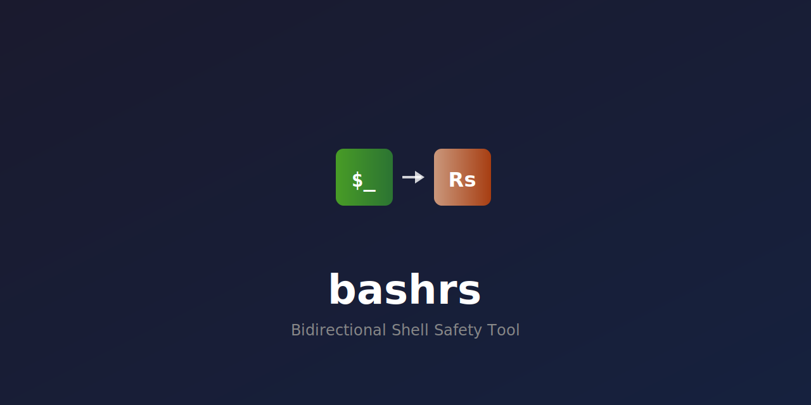

<p align="center">
  
</p>

<h1 align="center">bashrs</h1>

<p align="center">
  <strong>Rust-to-POSIX Shell Transpiler</strong>
</p>

<p align="center">
  <a href="https://crates.io/crates/bashrs">
    
  </a>
  <a href="https://docs.rs/bashrs">
    
  </a>
  <a href="https://github.com/paiml/bashrs/actions">
    
  </a>
  <a href="LICENSE">
    
  </a>
  <a href="https://blog.rust-lang.org/2024/10/17/Rust-1.82.0.html">
    
  </a>
</p>

<p align="center">
  <a href="#installation">Installation</a> |
  <a href="#quick-start">Quick Start</a> |
  <a href="#features">Features</a> |
  <a href="https://paiml.github.io/bashrs/">Book</a> |
  <a href="https://docs.rs/bashrs">API Docs</a>
</p>

A bidirectional shell safety tool that transpiles Rust to deterministic
POSIX shell scripts and purifies legacy bash into safe, portable shell.
Also known as **Rash** (the library crate). Part of the PAIML Sovereign
AI Stack transpiler family alongside
[depyler](https://github.com/paiml/depyler) and
[decy](https://github.com/paiml/decy).

---

## Table of Contents

- [What is bashrs?](#what-is-bashrs)
- [Installation](#installation)
- [Quick Start](#quick-start)
- [Features](#features)
- [Architecture](#architecture)
- [Quality](#quality)
- [Sovereign AI Stack](#sovereign-ai-stack)
- [Documentation](#documentation)
- [License](#license)

## What is bashrs?

Shell scripts power CI/CD pipelines, deployment automation, and system
configuration across every production environment. They are also
notoriously fragile -- unquoted variables, non-idempotent operations,
and injection vulnerabilities are the norm, not the exception.

bashrs solves this in two directions:

1. **Rust to Shell** -- Write type-safe Rust, transpile to
   deterministic POSIX shell with automatic safety guarantees.
2. **Shell to Shell** -- Purify existing bash scripts by rewriting
   unsafe patterns at the AST level, not just warning about them.

Generated scripts run on any POSIX-compliant system with zero runtime
dependencies. Same input always produces identical output.

## Installation

### CLI

```bash
cargo install bashrs
```

### Library

Add to your `Cargo.toml`:

```toml
[dependencies]
bashrs = "6.65"
```

## Quick Start

### Write Rust, Get Safe Shell

```rust
// install.rs
#[rash::main]
fn main() {
    let version = env_var_or("VERSION", "1.0.0");
    let prefix = env_var_or("PREFIX", "/usr/local");

    echo("Installing MyApp {version} to {prefix}");

    mkdir_p("{prefix}/bin");
    mkdir_p("{prefix}/share/myapp");

    if exec("cp myapp {prefix}/bin/") {
        echo("Binary installed");
    } else {
        eprint("Failed to install binary");
        exit(1);
    }
}
```

Transpile to safe POSIX shell:

```bash
bashrs build install.rs -o install.sh
```

### Purify Existing Bash

**Before** (unsafe bash):
```bash
#!/bin/bash
SESSION_ID=$RANDOM                      # Non-deterministic
mkdir /app/releases/$RELEASE            # Non-idempotent
rm /app/current                         # Fails if missing
```

**After** (purified by Rash):
```bash
#!/bin/sh
session_id="session-${version}"         # Deterministic
mkdir -p "/app/releases/${release}"     # Idempotent
rm -f "/app/current"                    # Safe removal
```

### CLI Usage

```bash
# Transpile Rust to shell
bashrs build input.rs -o output.sh

# Purify legacy bash scripts
bashrs purify messy.sh -o clean.sh

# Lint shell scripts (including Dockerfiles)
bashrs lint script.sh

# Quality scoring
bashrs score script.sh

# Interactive REPL
bashrs repl

# Mutation testing
bashrs mutate script.sh --count 10
```

## Features

- **POSIX Compliance** -- Generated scripts target POSIX sh and run on
  sh, dash, bash, ash, zsh, and mksh.
- **Injection Prevention** -- Automatic variable quoting, word-split
  protection, and glob expansion suppression at the AST level.
- **ShellCheck Integration** -- All transpiler output passes strict
  ShellCheck validation (99.9% compliance).
- **Dockerfile/Makefile Transpilation** -- Transpile and lint
  Dockerfiles and Makefiles alongside shell scripts.
- **Built-in Linter** -- 100+ lint rules with auto-fix, severity
  levels, `.bashrsignore` support, and watch mode.
- **Built-in Formatter** -- Configurable shell script formatter with
  TOML configuration.
- **Deterministic Output** -- Same input always produces identical
  scripts. Verified across 17,882 corpus entries.
- **MCP Server** -- Model Context Protocol server for AI-assisted shell
  generation (`rash-mcp`, registered as `io.github.paiml/rash`).
- **LSP Server** -- Language Server Protocol for editor integration.
- **Mutation Testing** -- 10 mutation operators (string, command,
  conditional, redirect) for test quality verification.

### Beyond ShellCheck

| ShellCheck | bashrs |
|------------|--------|
| Warns about unquoted variables | Quotes all variables automatically |
| Warns about non-deterministic `$RANDOM` | Rewrites to version-based deterministic IDs |
| Warns about non-idempotent `mkdir` | Transforms to `mkdir -p` |
| Static pattern matching | Full AST semantic understanding |
| Read-only analysis | Read-write transformation |

## Architecture

bashrs is a workspace of five crates:

| Crate | Purpose |
|-------|---------|
| `bashrs` (rash) | Core library: parser, transpiler, linter, formatter |
| `bashrs-specs` | Formal verification specs and benchmarks |
| `bashrs-oracle` | ML-powered error classification |
| `bashrs-wasm` | Browser-compatible WASM build |
| `rash-runtime` | Runtime support for transpiled scripts |

The transpilation pipeline:

```
Rust Source --> Parse (syn) --> Rash IR --> POSIX Shell AST --> Emit
                                  |
                                  +--> Makefile AST --> Emit
                                  |
                                  +--> Dockerfile AST --> Emit
```

The purification pipeline:

```
Bash Source --> Parse (AST) --> Safety Analysis --> Rewrite --> Emit
```

## Quality

| Metric | Value |
|--------|-------|
| Tests | 15,117 passing |
| Line Coverage | 95.04% |
| Corpus Score | 97.5/100 (Grade A+) |
| Corpus Entries | 17,882 (100% pass) |
| ShellCheck Compliance | 99.9% |
| Cross-Shell Compatibility | 6 shells (sh, dash, bash, ash, zsh, mksh) |
| Deterministic | 100% (same input = same output) |

bashrs uses Popperian falsification -- tests attempt to disprove
functionality rather than confirm it. A passing test means the
falsification attempt failed.

```bash
# 130-point transpiler falsification checklist
cargo test -p bashrs --test transpiler_tcode_tests

# 30-point Dockerfile falsification checklist
cargo test -p bashrs --test dockerfile_dcode_tests
```

### Performance

| Operation | Time |
|-----------|------|
| Rust-to-Shell transpilation | 21.1 us |
| Makefile parsing | 0.034--1.43 ms |
| Memory usage | < 10 MB |

## Sovereign AI Stack

bashrs is part of the PAIML Sovereign AI Stack -- a pure-Rust ecosystem
for privacy-preserving ML infrastructure.

| Layer | Crate | Purpose |
|-------|-------|---------|
| Compute | [trueno](https://crates.io/crates/trueno) | SIMD/GPU primitives (AVX2/AVX-512/NEON) |
| ML | [aprender](https://crates.io/crates/aprender) | ML algorithms, APR v2 model format |
| Training | [entrenar](https://crates.io/crates/entrenar) | Autograd, LoRA/QLoRA, quantization |
| Inference | [realizar](https://crates.io/crates/realizar) | LLM inference, GPU kernels |
| Distribution | [repartir](https://crates.io/crates/repartir) | Distributed compute (CPU/GPU/Remote) |
| Orchestration | [batuta](https://crates.io/crates/batuta) | Stack coordination and CLI |
| Transpilers | **bashrs**, [depyler](https://crates.io/crates/depyler), [decy](https://crates.io/crates/decy) | Shell/Python/C to Rust |
| Verification | [provable-contracts](https://crates.io/crates/provable-contracts) | YAML contract verification |

## Documentation

- **The Rash Book**: [paiml.github.io/bashrs](https://paiml.github.io/bashrs/) -- canonical documentation with tested examples
- **API Reference**: [docs.rs/bashrs](https://docs.rs/bashrs)
- **Cookbook**: [bashrs-cookbook](https://github.com/paiml/bashrs-cookbook) -- examples and recipes
- **Changelog**: [CHANGELOG.md](CHANGELOG.md)

## Contributing

1. Fork the repository
2. Make changes on the `master` branch
3. Run quality gates: `make lint && make test`
4. Run coverage: `make coverage`
5. Submit a pull request

## License

MIT License. See [LICENSE](LICENSE) for details.

---

<div align="center">
<sub>Part of the <a href="https://github.com/paiml">PAIML</a> Sovereign AI Stack</sub>
</div>
