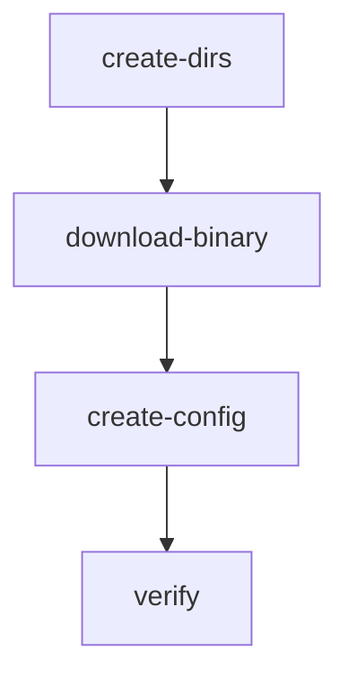

# Getting Started with Installers

This guide walks you through creating your first TDD-first installer.

## Prerequisites

- bashrs installed (`cargo install bashrs`)
- Basic understanding of shell scripting

## Step 1: Initialize Project

Create a new installer project:

```bash
bashrs installer init my-app-installer --description "My application installer"
```

Output:
```text
✓ Initialized installer project: my-app-installer
  Path: /path/to/my-app-installer

  Created:
    - installer.toml (installer specification)
    - tests/mod.rs (test harness)
    - tests/falsification.rs (Popper-style tests)
    - templates/ (template files)

Next steps:
  1. Edit installer.toml to define steps
  2. Run: bashrs installer validate my-app-installer
  3. Run: bashrs installer run my-app-installer --dry-run
```

## Step 2: Edit installer.toml

Open `installer.toml` and customize it for your application:

```toml
[installer]
name = "my-app"
version = "1.0.0"
description = "Installs My Application"
author = "Your Name <you@example.com>"

[installer.requirements]
os = ["ubuntu >= 20.04", "debian >= 11", "fedora >= 38"]
arch = ["x86_64", "aarch64"]
privileges = "user"  # or "root"
network = true

# Step 1: Create directories
[[step]]
id = "create-dirs"
name = "Create Installation Directories"
action = "script"

[step.script]
interpreter = "sh"
content = '''
mkdir -p ~/.local/bin
mkdir -p ~/.config/my-app
'''

[step.postconditions]
file_exists = "~/.local/bin"

[step.checkpoint]
enabled = true
rollback = "rm -rf ~/.local/bin ~/.config/my-app"

# Step 2: Download binary
[[step]]
id = "download-binary"
name = "Download Application Binary"
action = "script"
depends_on = ["create-dirs"]

[step.script]
content = '''
curl -fsSL https://github.com/example/my-app/releases/latest/download/my-app-linux-amd64 \
  -o ~/.local/bin/my-app
chmod +x ~/.local/bin/my-app
'''

[step.postconditions]
file_exists = "~/.local/bin/my-app"
file_mode = "755"

# Step 3: Create config
[[step]]
id = "create-config"
name = "Create Default Configuration"
action = "script"
depends_on = ["download-binary"]

[step.script]
content = '''
cat > ~/.config/my-app/config.toml << 'EOF'
[settings]
log_level = "info"
data_dir = "~/.local/share/my-app"
EOF
'''

# Step 4: Verify installation
[[step]]
id = "verify"
name = "Verify Installation"
action = "script"
depends_on = ["create-config"]

[step.script]
content = '''
~/.local/bin/my-app --version
'''

[step.verification]
commands = [
    { cmd = "~/.local/bin/my-app --version", expect = "my-app" }
]
```

## Step 3: Validate

Check that your installer is valid:

```bash
bashrs installer validate my-app-installer
```

Output:
```text
✓ Installer is valid
  Steps: 4
  Artifacts: 0
```

## Step 4: Preview with Dry-Run

See what changes will be made without executing:

```bash
bashrs installer run my-app-installer --dry-run --diff
```

## Step 5: Visualize Dependencies

Generate a dependency graph:

```bash
bashrs installer graph my-app-installer --format mermaid
```

Output:


## Step 6: Test Across Platforms

Test your installer on multiple platforms:

```bash
bashrs installer test my-app-installer --matrix "ubuntu:22.04,debian:12,fedora:39"
```

## Step 7: Execute

Run the installer:

```bash
bashrs installer run my-app-installer
```

## Resuming from Failures

If a step fails, the installer checkpoints progress. Resume with:

```bash
bashrs installer resume my-app-installer
```

Or restart from a specific step:

```bash
bashrs installer resume my-app-installer --from download-binary
```

## Next Steps

- Learn about [Step Types](./step-types.md)
- Configure [Checkpointing](./checkpointing.md)
- Set up Artifact Verification (coming soon)
