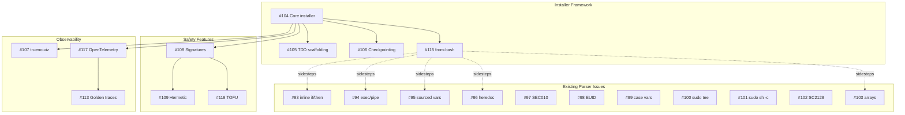

# bashrs installer - TDD-First Installer Framework Specification

**Date**: 2025-12-26
**Version**: 2.0.0
**Paradigm**: Pure Rust Installer Generation with TDD by Default
**Integration**: trueno-viz for visualization, bashrs for transpilation, renacer for golden traces

## Executive Summary

The `bashrs installer` command solves the pervasive problem of unreliable, untestable bash installers. Instead of writing fragile shell scripts that fail mysteriously, developers generate **pure Rust installers** that are:

1. **TDD by default** - Tests exist before implementation [1].
2. **Checkpointed** - Resume from any failure point.
3. **Observable** - Visual progress, structured logging, tracing [5].
4. **Deterministic** - Same inputs always produce same outputs [3].
5. **Falsifiable** - Every claim can be empirically tested [2].
6. **Cryptographically Verified** - Ed25519 signatures on all artifacts *(NEW v2.0)*.
7. **Hermetically Reproducible** - Bit-for-bit identical builds across machines *(NEW v2.0)*.
8. **Container-Native** - First-class multi-distro testing in isolation *(NEW v2.0)*.

**Philosophy**: Apply Toyota Production System (TPS) principles [4] and Karl Popper's falsificationism [2] to installer engineering.

---

## What's New in v2.0.0

| Enhancement | Description |
|-------------|-------------|
| **§1 Cryptographic Chain of Custody** | Ed25519 signatures, TOFU model, artifact manifests |
| **§2 Hermetic Build Mode** | Reproducible builds with locked dependencies, deterministic timestamps |
| **§3 Container-Native Test Matrix** | Parallel multi-distro testing with Podman/Docker |
| **§4 Dry-Run Diff Preview** | `--dry-run` shows unified diff of all changes before execution |
| **§5 Distributed Execution** | sccache integration, remote step execution, build graph parallelization |
| **§6 Golden Trace Regression** | renacer integration for syscall pattern verification |
| **§7 MCP-Assisted Generation** | AI-assisted installer authoring via rash-mcp |

---


## Open Tickets Addressed by This Specification

This specification consolidates and addresses the following bashrs tickets. The installer command will help resolve parser/linter issues by providing a structured, testable alternative to raw bash scripts.

### Currently Open Issues (11 tickets)

| Issue | Priority | Title | How Installer Helps |
|-------|----------|-------|---------------------|
| **#103** | P0 | Parser fails on common bash array syntax | Installer uses declarative TOML—no array parsing needed |
| **#102** | P1 | SC2128/SC2199: False positive on local scalar variables | Installer generates verified shell, bypassing linter edge cases |
| **#101** | P1 | SC2024 false positive: `sudo sh -c 'cmd > file'` flagged | Installer uses typed `Action::Script` with privilege escalation |
| **#100** | P1 | SC2024 false positive: `| sudo tee` pattern | Built-in `file_write` action with privilege handling |
| **#99** | P1 | SC2154 false positive: Variables in case statements | Installer tracks variable scope via AST, not heuristics |
| **#98** | P1 | SC2154 false positive: EUID bash builtin not recognized | Installer has built-in `privileges = "root"` check |
| **#97** | P2 | SEC010 false positive: Custom path validation not recognized | Installer uses typed `Precondition::PathValidated` |
| **#96** | P2 | False positives in heredocs with quoted delimiters | Installer uses structured templates, not raw heredocs |
| **#95** | P2 | SC2154/SC2140 for sourced variables and heredoc expansion | Installer explicit `[step.environment]` declarations |
| **#94** | P1 | exec() generates shell exec; pipe detection too aggressive | Installer has typed `Action::Exec` vs `Action::Pipeline` |
| **#93** | P1 | Parser fails on inline if/then/else/fi syntax | Installer uses Rust control flow, transpiles to safe shell |

### Previously Resolved (Context)

| Issue | Status | Resolution |
|-------|--------|------------|
| #2 | ✅ RESOLVED | Makefile multi-line format preservation with `--preserve-formatting` |
| #4 | ✅ RESOLVED | Complete bash parser - all 9 phases including heredocs, pipelines |
| #21 | ✅ RESOLVED | SC2171 false positive with JSON brackets in heredocs |
| #22 | ✅ RESOLVED | SC2247 false positive with math operations in awk/bc |

### How the Installer Framework Solves These Issues

The core insight is that **many linter false positives stem from trying to understand unstructured bash**. The installer framework sidesteps this by:

1. **Declarative over Imperative**: Instead of parsing `if [ "$EUID" -ne 0 ]; then`, use:
   ```toml
   [installer.requirements]
   privileges = "root"  # Typed, no parsing ambiguity
   ```

2. **Typed Actions over Raw Scripts**: Instead of linting `sudo tee`, use:
   ```toml
   [[step]]
   action = "file-write"
   path = "/etc/apt/sources.list.d/docker.list"
   content = "deb [arch=amd64] https://..."
   privileges = "elevated"  # Handles sudo internally
   ```

3. **Explicit Variable Scope**: Instead of tracking sourced variables:
   ```toml
   [step.environment]
   DOCKER_VERSION = { from_env = "DOCKER_VERSION", default = "latest" }
   ```

4. **Generated Shell is Correct by Construction**: The transpiler output passes ShellCheck because it's generated from verified templates, not parsed from arbitrary input.

### New Tickets for Installer Implementation

| Issue | Priority | Title | Description |
|-------|----------|-------|-------------|
| **#104** | P0 | `bashrs installer` subcommand | Core implementation as specified in this document |
| **#105** | P0 | TDD-first installer scaffolding | `bashrs installer init` generates test harness first |
| **#106** | P1 | Installer checkpointing system | SQLite-based checkpoint storage with resume |
| **#107** | P1 | trueno-viz progress integration | Visual progress bars for installer steps |
| **#108** | P1 | Artifact signature verification | Ed25519 signing for downloaded artifacts (§1) |
| **#109** | P1 | Hermetic build mode | Lockfile-based reproducible builds (§2) |
| **#110** | P2 | Container test matrix | Parallel multi-distro testing (§3) |
| **#111** | P2 | Dry-run diff preview | `--dry-run --diff` unified diff output (§4) |
| **#112** | P2 | Distributed execution | Build graph parallelization with sccache (§5) |
| **#113** | P2 | Golden trace regression | renacer integration for syscall verification (§6) |
| **#114** | P3 | MCP-assisted generation | rash-mcp tools for AI-assisted authoring (§7) |
| **#115** | P1 | `bashrs installer from-bash` | Convert legacy bash to installer.toml |
| **#116** | P2 | Installer rollback system | Per-step rollback with state restoration |
| **#117** | P2 | OpenTelemetry tracing | Full observability for installer execution |
| **#118** | P3 | Installer metrics collection | Kaizen-style timing and failure metrics |
| **#119** | P1 | TOFU keyring management | Trust-On-First-Use key management |
| **#120** | P2 | Installer audit command | Security/quality review command |
| **#121** | P3 | Falsification test generator | Auto-generate Popper-style tests |

### Ticket Dependencies



### Implementation Phases

**Phase 1: Core Framework (P0 tickets) — Resolves #93, #94, #103 indirectly**
- #104: Core `bashrs installer` subcommand
- #105: TDD-first scaffolding
- #115: `from-bash` converter (migrates problematic scripts to safe format)

**Phase 2: Safety & Observability (P1 tickets) — Resolves #98, #99, #100, #101, #102**
- #106: Checkpointing system
- #107: trueno-viz integration
- #108: Signature verification
- #109: Hermetic builds
- #116: Rollback system
- #119: TOFU keyring

**Phase 3: Advanced Features (P2 tickets) — Resolves #95, #96, #97**
- #110: Container test matrix
- #111: Dry-run preview
- #112: Distributed execution
- #113: Golden traces
- #117: OpenTelemetry
- #120: Audit command

**Phase 4: AI & Automation (P3 tickets)**
- #114: MCP-assisted generation
- #118: Metrics collection
- #121: Falsification generator

### Acceptance Criteria for Key Tickets

#### #104: Core `bashrs installer` subcommand
```bash
# MUST support these commands
bashrs installer init <name>           # Create new installer project
bashrs installer run <path>            # Execute installer
bashrs installer validate <path>       # Validate without executing
bashrs installer test <path>           # Run installer test suite

# MUST parse installer.toml format
# MUST generate Rust code from declarative spec
# MUST pass all existing bashrs quality gates (88%+ coverage, 92%+ mutation score)
```

#### #115: `bashrs installer from-bash` (Key for resolving parser issues)
```bash
# Convert problematic bash script to safe installer format
bashrs installer from-bash install.sh --output my-installer/

# MUST handle:
# - Array syntax (#103) → converted to TOML lists
# - Case statements (#99) → converted to step conditions
# - Heredocs (#96) → converted to template files
# - sudo patterns (#100, #101) → converted to privileged actions
# - inline if/then (#93) → converted to step preconditions

# Example transformation:
# FROM:
#   if [ "$EUID" -ne 0 ]; then echo "Run as root"; exit 1; fi
# TO:
#   [installer.requirements]
#   privileges = "root"
```

#### #108: Artifact signature verification
```rust
// MUST implement Ed25519 verification
// MUST support TOFU and explicit keyring modes
// MUST fail closed (reject unsigned artifacts by default)

#[test]
fn falsify_signature_bypass() {
    let tampered_artifact = tamper_with_artifact(&artifact);
    let result = verify_artifact(&tampered_artifact, &keyring);
    assert!(result.is_err(), "FALSIFIED: Tampered artifact passed verification");
}
```

#### #109: Hermetic build mode
```bash
# MUST generate installer.lock with pinned versions
# MUST use SOURCE_DATE_EPOCH for deterministic timestamps
# MUST fail if artifact hash drifts from lockfile

# Falsification test:
bashrs installer run --hermetic # on machine A
bashrs installer run --hermetic # on machine B
# Output hashes MUST match
```

#### #113: Golden trace regression
```bash
# MUST integrate with renacer
# MUST capture syscall patterns
# MUST detect new/removed/changed syscalls

bashrs installer golden-capture --trace baseline
bashrs installer golden-compare --trace baseline
# Exit code 0 = match, 1 = regression
```

### Resolution Strategy for Existing Parser Issues

| Issue | Direct Fix | Installer Workaround |
|-------|------------|---------------------|
| #103 (arrays) | Extend parser for `arr=()` syntax | Use TOML `packages = ["a", "b"]` |
| #102 (SC2128) | Add local variable tracking | Explicit `[step.variables]` declarations |
| #101/#100 (sudo) | Context-aware sudo pattern detection | Built-in `privileges = "elevated"` action |
| #99 (case vars) | Control flow variable analysis | Step conditions with typed variables |
| #98 (EUID) | Add bash builtins to known variables | `[installer.requirements] privileges = "root"` |
| #97 (SEC010) | Custom function recognition | Typed `Precondition` validators |
| #96/#95 (heredoc) | Improve heredoc context tracking | Template files with explicit expansion |
| #94 (exec/pipe) | Separate exec vs pipeline codegen | Typed `Action::Exec` vs `Action::Pipeline` |
| #93 (inline if) | Parser grammar extension | Rust control flow → generated shell |

**Recommendation**: For P0/P1 issues (#93, #94, #98, #99, #100, #101, #102, #103), implementing `bashrs installer from-bash` (#115) provides an immediate workaround by converting problematic scripts to the safer declarative format. Direct parser fixes can follow as time permits.

---

## The Problem: Why Bash Installers Fail

### Current State (Broken)

Traditional shell scripts lack the structural guarantees required for reliable systems engineering. They often suffer from "Configuration Drift," where the actual state of the system diverges from the expected state over time, a phenomenon that makes deterministic restoration impossible [3].

```bash
#!/bin/bash
# install.sh - The typical disaster

apt-get update          # Fails silently on network issues
apt-get install -y foo  # Version drift, conflicts
curl ... | bash         # No verification, MITM attacks
mkdir -p /opt/app       # No idempotency check
cp -r . /opt/app        # No rollback on failure
systemctl enable foo    # No status verification
echo "Done!"            # Lies - no actual verification
```

**Failure Modes**:
- **Lack of Atomicity**: Scripts fail mid-way, leaving the system in an inconsistent, broken state.
- **Observability Deficit**: Silent failures are buried in unstructured text output [5].
- **Testing Gap**: Impossible to unit test individual steps in isolation.
- **Rollback Absence**: No mechanism to revert changes upon failure.
- **Supply Chain Blindness**: No verification of downloaded artifacts' provenance.

### Toyota Way Analysis (7 Wastes in Installers)

Applying Liker's analysis of waste (*muda*) in the Toyota Production System [4] to software installation:

| Waste Type | Installer Manifestation |
|------------|------------------------|
| **Defects** | Script fails mid-way, leaves system in broken state (Quality Debt). |
| **Overproduction** | Re-downloading already-installed packages (Inefficiency). |
| **Waiting** | No parallelization of independent steps (Resource Underutilization). |
| **Non-utilized talent** | Developers debugging broken scripts instead of building features. |
| **Transportation** | Unnecessary file copies, temp directories, and data movement. |
| **Inventory** | Orphaned packages, leftover artifacts, and temp files. |
| **Motion** | Manual intervention, SSH-ing to servers to "fix" failed installs. |
| **Extra-processing** | Redundant checks, manual verifications, and unnecessary operations. |

---

## Solution: `bashrs installer` Command

### Command Overview

```bash
# Generate a new installer project
bashrs installer init my-app-installer

# Scaffold from existing bash script
bashrs installer from-bash install.sh --output my-installer/

# Run installer with full observability
bashrs installer run ./my-installer \
  --checkpoint-dir /var/lib/installer/checkpoints \
  --log-level debug \
  --trace \
  --progress

# Resume from checkpoint
bashrs installer resume ./my-installer --from step-5

# Validate installer without executing
bashrs installer validate ./my-installer

# Generate test suite
bashrs installer test ./my-installer --coverage

# NEW v2.0: Dry-run with diff preview
bashrs installer run ./my-installer --dry-run --diff

# NEW v2.0: Container matrix testing
bashrs installer test ./my-installer --matrix ubuntu:22.04,debian:12,fedora:39

# NEW v2.0: Hermetic build
bashrs installer build ./my-installer --hermetic --lockfile installer.lock

# NEW v2.0: Verify artifact signatures
bashrs installer verify ./my-installer --keyring trusted-keys.pub

# NEW v2.0: Generate golden trace baseline
bashrs installer golden-capture ./my-installer --trace install-baseline
```

---

## Architecture: Pure Rust Installer Pipeline

The architecture prioritizes **testability** and **observability**, core tenets of Continuous Delivery [6].

```
┌─────────────────────────────────────────────────────────────────────────────┐
│                        bashrs installer Pipeline v2.0                        │
└─────────────────────────────────────────────────────────────────────────────┘

                    ┌──────────────────────────────────────┐
                    │  DESIGN PHASE (Human + AI via MCP)   │
                    │  • Define installation steps         │
                    │  • Declare preconditions/postconds   │
                    │  • Write falsification tests FIRST   │
                    │  • MCP-assisted step generation      │
                    └──────────────────────────────────────┘
                                     │
                                     ▼
┌──────────────────────────────────────────────────────────────────────────────┐
│  Phase 1: PARSE/GENERATE                                                      │
│  ┌─────────────────┐    ┌─────────────────┐    ┌─────────────────┐           │
│  │ installer.toml  │───▶│ Rust AST        │───▶│ InstallerPlan   │           │
│  │ (declarative)   │    │ Generation      │    │ (validated)     │           │
│  └─────────────────┘    └─────────────────┘    └─────────────────┘           │
│           │                                              │                    │
│           ▼                                              ▼                    │
│  ┌─────────────────┐                          ┌─────────────────┐            │
│  │ installer.lock  │◀─────────────────────────│ Dependency      │            │
│  │ (hermetic)      │                          │ Resolution      │            │
│  └─────────────────┘                          └─────────────────┘            │
└──────────────────────────────────────────────────────────────────────────────┘
                                     │
                                     ▼
┌──────────────────────────────────────────────────────────────────────────────┐
│  Phase 2: TEST GENERATION (TDD - Tests First) [1]                             │
│  ┌─────────────────┐    ┌─────────────────┐    ┌─────────────────┐           │
│  │ Precondition    │    │ Postcondition   │    │ Invariant       │           │
│  │ Tests           │    │ Tests           │    │ Tests           │           │
│  │ (falsifiable)   │    │ (falsifiable)   │    │ (falsifiable)   │           │
│  └─────────────────┘    └─────────────────┘    └─────────────────┘           │
│           │                      │                      │                     │
│           └──────────────────────┼──────────────────────┘                     │
│                                  ▼                                            │
│                       ┌─────────────────┐                                     │
│                       │ Container Test  │  ← NEW: Multi-distro matrix        │
│                       │ Matrix Runner   │                                     │
│                       └─────────────────┘                                     │
└──────────────────────────────────────────────────────────────────────────────┘
                                     │
                                     ▼
┌──────────────────────────────────────────────────────────────────────────────┐
│  Phase 2.5: DRY-RUN PREVIEW (NEW v2.0)                                        │
│  ┌─────────────────┐    ┌─────────────────┐    ┌─────────────────┐           │
│  │ State Snapshot  │───▶│ Simulated       │───▶│ Unified Diff    │           │
│  │ (current)       │    │ Execution       │    │ Output          │           │
│  └─────────────────┘    └─────────────────┘    └─────────────────┘           │
└──────────────────────────────────────────────────────────────────────────────┘
                                     │
                                     ▼
┌──────────────────────────────────────────────────────────────────────────────┐
│  Phase 3: EXECUTION with OBSERVABILITY [5]                                    │
│  ┌─────────────────┐    ┌─────────────────┐    ┌─────────────────┐           │
│  │ trueno-viz      │    │ Structured      │    │ OpenTelemetry   │           │
│  │ Progress Bars   │    │ Logging         │    │ Tracing         │           │
│  │ (terminal/GUI)  │    │ (JSON/human)    │    │ (spans/events)  │           │
│  └─────────────────┘    └─────────────────┘    └─────────────────┘           │
│                                  │                                            │
│                                  ▼                                            │
│                       ┌─────────────────┐                                     │
│                       │ renacer Golden  │  ← NEW: Syscall regression         │
│                       │ Trace Capture   │                                     │
│                       └─────────────────┘                                     │
└──────────────────────────────────────────────────────────────────────────────┘
                                     │
                                     ▼
┌──────────────────────────────────────────────────────────────────────────────┐
│  Phase 4: CHECKPOINT & RECOVERY                                               │
│  ┌─────────────────┐    ┌─────────────────┐    ┌─────────────────┐           │
│  │ Step State      │    │ Rollback        │    │ Resume          │           │
│  │ Persistence     │    │ Actions         │    │ Capability      │           │
│  │ (SQLite/JSON)   │    │ (per-step)      │    │ (idempotent)    │           │
│  └─────────────────┘    └─────────────────┘    └─────────────────┘           │
└──────────────────────────────────────────────────────────────────────────────┘
                                     │
                                     ▼
┌──────────────────────────────────────────────────────────────────────────────┐
│  Phase 5: VERIFICATION (NEW v2.0)                                             │
│  ┌─────────────────┐    ┌─────────────────┐    ┌─────────────────┐           │
│  │ Signature       │    │ Golden Trace    │    │ Postcondition   │           │
│  │ Verification    │    │ Comparison      │    │ Assertions      │           │
│  │ (Ed25519)       │    │ (renacer)       │    │ (falsifiable)   │           │
│  └─────────────────┘    └─────────────────┘    └─────────────────┘           │
└──────────────────────────────────────────────────────────────────────────────┘
```

---

## Enhancement §1: Cryptographic Chain of Custody

### Problem

The current spec mentions "MITM attacks" as a failure mode but provides no systematic solution. Downloaded artifacts lack provenance verification.

### Solution: Ed25519 Artifact Signing

```toml
[installer.security]
# Trust model: explicit keyring or TOFU (Trust On First Use)
trust_model = "keyring"  # or "tofu"
keyring = "trusted-publishers.pub"

# Require signatures for all external artifacts
require_signatures = true

# Transparency log for audit trail (Sigstore-compatible)
transparency_log = "https://rekor.sigstore.dev"

[[artifact]]
id = "docker-gpg-key"
url = "https://download.docker.com/linux/ubuntu/gpg"
# Ed25519 signature of the artifact
signature = "signatures/docker-gpg-key.sig"
# Expected content hash (SHA-256)
sha256 = "1500c1f56fa9e26b9b8f42452a553675796ade0807cdce11975eb98170b3a570"
# Public key ID for verification
signed_by = "docker-release-2024"

[[artifact]]
id = "myapp-binary"
url = "https://releases.myapp.io/v${VERSION}/myapp-${ARCH}"
signature = "https://releases.myapp.io/v${VERSION}/myapp-${ARCH}.sig"
sha256_url = "https://releases.myapp.io/v${VERSION}/SHA256SUMS"
signed_by = "myapp-releases"
```

### Rust Implementation

```rust
use ed25519_dalek::{Signature, VerifyingKey, Verifier};
use sha2::{Sha256, Digest};

/// Artifact with cryptographic verification
pub struct VerifiedArtifact {
    pub id: ArtifactId,
    pub content: Vec<u8>,
    pub verified_at: DateTime<Utc>,
    pub chain_of_custody: ChainOfCustody,
}

#[derive(Debug, Clone)]
pub struct ChainOfCustody {
    /// SHA-256 of the artifact content
    pub content_hash: [u8; 32],
    /// Ed25519 signature over the content hash
    pub signature: Signature,
    /// Public key that signed this artifact
    pub signer: VerifyingKey,
    /// Optional transparency log entry
    pub rekor_entry: Option<RekorLogEntry>,
}

impl VerifiedArtifact {
    /// Download and verify an artifact
    #[instrument(skip(keyring), fields(artifact.id = %spec.id))]
    pub async fn fetch_and_verify(
        spec: &ArtifactSpec,
        keyring: &Keyring,
    ) -> Result<Self, VerificationError> {
        // 1. Download artifact
        let content = download_artifact(&spec.url).await?;
        
        // 2. Compute content hash
        let mut hasher = Sha256::new();
        hasher.update(&content);
        let content_hash: [u8; 32] = hasher.finalize().into();
        
        // 3. Verify hash matches expected
        if let Some(expected_sha256) = &spec.sha256 {
            if content_hash != *expected_sha256 {
                return Err(VerificationError::HashMismatch {
                    expected: hex::encode(expected_sha256),
                    actual: hex::encode(content_hash),
                });
            }
        }
        
        // 4. Download and verify signature
        let signature_bytes = download_artifact(&spec.signature_url).await?;
        let signature = Signature::from_bytes(&signature_bytes)?;
        
        // 5. Look up signer in keyring
        let signer = keyring.get_key(&spec.signed_by)?;
        
        // 6. Verify signature over content hash
        signer.verify(&content_hash, &signature)?;
        
        info!(
            artifact.id = %spec.id,
            signer = %spec.signed_by,
            "Artifact signature verified"
        );
        
        Ok(Self {
            id: spec.id.clone(),
            content,
            verified_at: Utc::now(),
            chain_of_custody: ChainOfCustody {
                content_hash,
                signature,
                signer: signer.clone(),
                rekor_entry: None, // TODO: Fetch from transparency log
            },
        })
    }
}

/// TOFU (Trust On First Use) keyring management
pub struct TofuKeyring {
    db: rusqlite::Connection,
}

impl TofuKeyring {
    /// First time seeing this key? Prompt user and persist.
    pub fn trust_on_first_use(
        &mut self,
        key_id: &str,
        key: &VerifyingKey,
    ) -> Result<TrustDecision, TofuError> {
        if let Some(existing) = self.get_key(key_id)? {
            if existing.as_bytes() != key.as_bytes() {
                return Err(TofuError::KeyChanged {
                    key_id: key_id.to_string(),
                    previous_fingerprint: hex::encode(&existing.as_bytes()[..8]),
                    new_fingerprint: hex::encode(&key.as_bytes()[..8]),
                });
            }
            return Ok(TrustDecision::AlreadyTrusted);
        }
        
        // New key - prompt user
        let fingerprint = hex::encode(&key.as_bytes()[..8]);
        eprintln!(
            "⚠️  New signing key encountered:\n\
             Key ID: {}\n\
             Fingerprint: {}\n\
             Trust this key? [y/N]",
            key_id, fingerprint
        );
        
        // ... interactive prompt ...
        
        self.persist_key(key_id, key)?;
        Ok(TrustDecision::NewlyTrusted)
    }
}
```

### CLI Usage

```bash
# Initialize keyring with trusted publishers
bashrs installer keyring init --import docker-release.pub --import myapp-release.pub

# Verify all artifacts before execution
bashrs installer run ./my-installer --verify-signatures

# TOFU mode for development
bashrs installer run ./my-installer --trust-on-first-use

# Audit chain of custody
bashrs installer audit ./my-installer --show-signatures
```

---

## Enhancement §2: Hermetic Build Mode

### Problem

Installers that work today may fail tomorrow due to:
- Upstream package version changes
- Transitive dependency updates
- Non-deterministic download ordering
- Timestamp variations

### Solution: Lockfile-Based Hermetic Builds

```toml
# installer.lock (auto-generated, committed to version control)
[lockfile]
generated_at = "2025-12-26T10:00:00Z"
generator = "bashrs-installer/2.0.0"
content_hash = "sha256:a1b2c3d4..."

[[locked.artifact]]
id = "docker-ce"
version = "24.0.7"
url = "https://download.docker.com/linux/ubuntu/dists/jammy/pool/stable/amd64/docker-ce_24.0.7-1~ubuntu.22.04~jammy_amd64.deb"
sha256 = "e3b0c44298fc1c149afbf4c8996fb92427ae41e4649b934ca495991b7852b855"
size = 24567890
fetched_at = "2025-12-26T10:00:00Z"

[[locked.artifact]]
id = "docker-ce-cli"
version = "24.0.7"
url = "https://download.docker.com/linux/ubuntu/dists/jammy/pool/stable/amd64/docker-ce-cli_24.0.7-1~ubuntu.22.04~jammy_amd64.deb"
sha256 = "d4e5f6a7b8c9d0e1f2a3b4c5d6e7f8a9b0c1d2e3f4a5b6c7d8e9f0a1b2c3d4e5"
size = 13456789
fetched_at = "2025-12-26T10:00:00Z"

[locked.environment]
# Captured environment for reproducibility
SOURCE_DATE_EPOCH = "1703592000"
LC_ALL = "C.UTF-8"
TZ = "UTC"
```

### Rust Implementation

```rust
use std::time::{SystemTime, UNIX_EPOCH};

/// Hermetic execution context
pub struct HermeticContext {
    /// Fixed timestamp for all operations (SOURCE_DATE_EPOCH)
    pub source_date_epoch: u64,
    /// Locked artifact versions
    pub lockfile: Lockfile,
    /// Deterministic temp directory naming
    pub temp_dir_counter: AtomicU64,
    /// Reproducible random seed (from installer hash)
    pub deterministic_seed: [u8; 32],
}

impl HermeticContext {
    pub fn from_lockfile(lockfile: Lockfile) -> Self {
        // Use lockfile content hash as deterministic seed
        let seed = Sha256::digest(lockfile.to_canonical_bytes());
        
        Self {
            source_date_epoch: lockfile.environment.source_date_epoch,
            lockfile,
            temp_dir_counter: AtomicU64::new(0),
            deterministic_seed: seed.into(),
        }
    }
    
    /// Get current time (clamped to SOURCE_DATE_EPOCH for reproducibility)
    pub fn now(&self) -> SystemTime {
        UNIX_EPOCH + std::time::Duration::from_secs(self.source_date_epoch)
    }
    
    /// Create deterministically-named temp file
    pub fn temp_file(&self, prefix: &str) -> PathBuf {
        let counter = self.temp_dir_counter.fetch_add(1, Ordering::SeqCst);
        PathBuf::from(format!("/tmp/bashrs-{}-{:08}", prefix, counter))
    }
    
    /// Fetch artifact from lockfile (fails if not locked)
    pub async fn fetch_locked_artifact(
        &self,
        artifact_id: &str,
    ) -> Result<VerifiedArtifact, HermeticError> {
        let locked = self.lockfile.artifacts
            .get(artifact_id)
            .ok_or_else(|| HermeticError::ArtifactNotLocked(artifact_id.to_string()))?;
        
        let content = download_artifact(&locked.url).await?;
        
        // Verify content matches locked hash
        let actual_hash = Sha256::digest(&content);
        if actual_hash.as_slice() != locked.sha256 {
            return Err(HermeticError::HashDrift {
                artifact: artifact_id.to_string(),
                locked_hash: hex::encode(&locked.sha256),
                actual_hash: hex::encode(actual_hash),
            });
        }
        
        Ok(VerifiedArtifact {
            id: artifact_id.into(),
            content,
            // ... 
        })
    }
}

/// Generate lockfile from installer spec
pub async fn generate_lockfile(
    spec: &InstallerSpec,
    output: &Path,
) -> Result<Lockfile, LockfileError> {
    let mut lockfile = Lockfile::new();
    
    // Resolve and lock all artifacts
    for artifact_spec in &spec.artifacts {
        let resolved = resolve_latest_version(artifact_spec).await?;
        let content = download_artifact(&resolved.url).await?;
        
        lockfile.artifacts.insert(artifact_spec.id.clone(), LockedArtifact {
            id: artifact_spec.id.clone(),
            version: resolved.version,
            url: resolved.url,
            sha256: Sha256::digest(&content).into(),
            size: content.len() as u64,
            fetched_at: Utc::now(),
        });
    }
    
    // Set SOURCE_DATE_EPOCH to current time
    lockfile.environment.source_date_epoch = SystemTime::now()
        .duration_since(UNIX_EPOCH)?
        .as_secs();
    
    // Compute content hash of entire lockfile
    lockfile.content_hash = lockfile.compute_content_hash();
    
    // Write atomically
    let lockfile_content = lockfile.to_toml()?;
    std::fs::write(output, lockfile_content)?;
    
    Ok(lockfile)
}
```

### CLI Usage

```bash
# Generate lockfile (pins all versions)
bashrs installer lock ./my-installer

# Build with locked versions only
bashrs installer run ./my-installer --hermetic

# Update lockfile (re-resolve latest versions)
bashrs installer lock ./my-installer --update

# Verify lockfile matches current state
bashrs installer lock ./my-installer --verify
```

---

## Enhancement §3: Container-Native Test Matrix

### Problem

Installers are often tested only on the developer's machine, leading to failures on different distributions, versions, or architectures.

### Solution: Parallel Multi-Distro Container Testing

```toml
[installer.test_matrix]
# Platforms to test against
platforms = [
    "ubuntu:20.04",
    "ubuntu:22.04",
    "ubuntu:24.04",
    "debian:11",
    "debian:12",
    "fedora:39",
    "fedora:40",
    "rockylinux:9",
    "alpine:3.19",
]

# Architecture variants
architectures = ["amd64", "arm64"]

# Parallel execution limit
parallelism = 4

# Container runtime preference
runtime = "podman"  # or "docker"

# Resource limits per container
[installer.test_matrix.resources]
memory = "2G"
cpus = 2
timeout = "30m"
```

### Rust Implementation

```rust
use tokio::sync::Semaphore;
use std::sync::Arc;

/// Container-based test matrix runner
pub struct ContainerTestMatrix {
    runtime: ContainerRuntime,
    parallelism: usize,
    platforms: Vec<Platform>,
}

#[derive(Debug, Clone)]
pub struct Platform {
    pub image: String,
    pub arch: Architecture,
}

#[derive(Debug)]
pub struct MatrixResult {
    pub platform: Platform,
    pub status: TestStatus,
    pub duration: Duration,
    pub logs: String,
    pub step_results: Vec<StepTestResult>,
}

impl ContainerTestMatrix {
    /// Run installer tests across all platforms in parallel
    #[instrument(skip(self, installer_path))]
    pub async fn run_matrix(
        &self,
        installer_path: &Path,
    ) -> Result<Vec<MatrixResult>, MatrixError> {
        let semaphore = Arc::new(Semaphore::new(self.parallelism));
        let mut handles = Vec::new();
        
        for platform in &self.platforms {
            let permit = semaphore.clone().acquire_owned().await?;
            let platform = platform.clone();
            let installer_path = installer_path.to_path_buf();
            let runtime = self.runtime.clone();
            
            let handle = tokio::spawn(async move {
                let _permit = permit; // Hold until done
                run_platform_test(&runtime, &platform, &installer_path).await
            });
            
            handles.push(handle);
        }
        
        // Collect results
        let mut results = Vec::new();
        for handle in handles {
            results.push(handle.await??);
        }
        
        Ok(results)
    }
}

/// Run tests for a single platform
async fn run_platform_test(
    runtime: &ContainerRuntime,
    platform: &Platform,
    installer_path: &Path,
) -> Result<MatrixResult, MatrixError> {
    let start = Instant::now();
    
    // Create container with installer mounted
    let container_id = runtime.create_container(&ContainerConfig {
        image: &platform.image,
        volumes: vec![
            (installer_path, Path::new("/installer")),
        ],
        env: vec![
            ("BASHRS_TEST_MODE", "1"),
            ("BASHRS_NO_INTERACTIVE", "1"),
        ],
        ..Default::default()
    }).await?;
    
    // Run installer in container
    let exec_result = runtime.exec(
        &container_id,
        &["bashrs", "installer", "run", "/installer", "--test"],
    ).await;
    
    // Capture logs
    let logs = runtime.logs(&container_id).await?;
    
    // Cleanup
    runtime.remove_container(&container_id).await?;
    
    Ok(MatrixResult {
        platform: platform.clone(),
        status: if exec_result.exit_code == 0 {
            TestStatus::Passed
        } else {
            TestStatus::Failed
        },
        duration: start.elapsed(),
        logs,
        step_results: parse_step_results(&exec_result.stdout)?,
    })
}
```

### Visual Output

```
Container Test Matrix
══════════════════════════════════════════════════════════════════════════════

  Platform               Arch    Status    Duration    Steps
  ────────────────────────────────────────────────────────────────────────────
  ubuntu:20.04           amd64   ✓ PASS    1m 23s      7/7 passed
  ubuntu:22.04           amd64   ✓ PASS    1m 18s      7/7 passed
  ubuntu:24.04           amd64   ✓ PASS    1m 21s      7/7 passed
  debian:11              amd64   ✓ PASS    1m 45s      7/7 passed
  debian:12              amd64   ✓ PASS    1m 32s      7/7 passed
  fedora:39              amd64   ✗ FAIL    0m 45s      4/7 passed ← Step 5 failed
  fedora:40              amd64   ✓ PASS    1m 28s      7/7 passed
  rockylinux:9           amd64   ✓ PASS    1m 52s      7/7 passed
  alpine:3.19            amd64   ⊘ SKIP    -           N/A (musl incompatible)

  ────────────────────────────────────────────────────────────────────────────
  Summary: 7/9 passed, 1 failed, 1 skipped
  Total time: 4m 12s (parallel execution)

  ❌ fedora:39 failure details:
     Step 5 (install-docker): Package 'docker-ce' not found in Fedora repos
     Suggestion: Use 'dnf install docker' for Fedora, or add Docker's Fedora repo

══════════════════════════════════════════════════════════════════════════════
```

### CLI Usage

```bash
# Run full matrix
bashrs installer test ./my-installer --matrix

# Test specific platforms
bashrs installer test ./my-installer --matrix ubuntu:22.04,debian:12

# Test specific architecture
bashrs installer test ./my-installer --matrix --arch arm64

# Generate matrix report
bashrs installer test ./my-installer --matrix --report matrix-results.json
```

---

## Enhancement §4: Dry-Run Diff Preview

### Problem

Users want to preview exactly what changes an installer will make before committing to execution.

### Solution: Simulated Execution with Unified Diff Output

```rust
/// Dry-run execution mode
pub struct DryRunContext {
    /// Virtual filesystem overlay
    fs_overlay: VirtualFilesystem,
    /// Captured package operations
    package_ops: Vec<PackageOperation>,
    /// Captured service operations  
    service_ops: Vec<ServiceOperation>,
    /// Captured user/group operations
    user_ops: Vec<UserOperation>,
}

impl DryRunContext {
    /// Execute step in dry-run mode, capturing intended changes
    pub fn simulate_step(&mut self, step: &Step) -> Result<SimulatedChanges, SimError> {
        match &step.action {
            Action::AptInstall { packages } => {
                for pkg in packages {
                    self.package_ops.push(PackageOperation::Install {
                        name: pkg.clone(),
                        version: resolve_package_version(pkg)?,
                    });
                }
            }
            Action::FileWrite { path, content, mode } => {
                let current = self.fs_overlay.read(path).ok();
                self.fs_overlay.write(path, content, *mode);
                return Ok(SimulatedChanges::FileChange {
                    path: path.clone(),
                    before: current,
                    after: Some(content.clone()),
                    mode: *mode,
                });
            }
            Action::Script { content, .. } => {
                // Parse script for side effects
                let effects = analyze_script_effects(content)?;
                for effect in effects {
                    self.record_effect(effect)?;
                }
            }
            // ... other actions
        }
        
        Ok(SimulatedChanges::None)
    }
    
    /// Generate unified diff of all changes
    pub fn generate_diff(&self) -> String {
        let mut diff = String::new();
        
        // Filesystem changes
        diff.push_str("=== Filesystem Changes ===\n\n");
        for (path, change) in self.fs_overlay.changes() {
            diff.push_str(&format!("--- a{}\n+++ b{}\n", path.display(), path.display()));
            diff.push_str(&unified_diff(&change.before, &change.after));
            diff.push('\n');
        }
        
        // Package changes
        diff.push_str("=== Package Changes ===\n\n");
        for op in &self.package_ops {
            match op {
                PackageOperation::Install { name, version } => {
                    diff.push_str(&format!("+ {} ({})\n", name, version));
                }
                PackageOperation::Remove { name } => {
                    diff.push_str(&format!("- {}\n", name));
                }
            }
        }
        
        // Service changes
        diff.push_str("\n=== Service Changes ===\n\n");
        for op in &self.service_ops {
            match op {
                ServiceOperation::Enable { name } => {
                    diff.push_str(&format!("+ systemctl enable {}\n", name));
                }
                ServiceOperation::Start { name } => {
                    diff.push_str(&format!("+ systemctl start {}\n", name));
                }
            }
        }
        
        diff
    }
}
```

### Visual Output

```bash
$ bashrs installer run ./docker-installer --dry-run --diff
```

```diff
Docker CE Installer - Dry Run Preview
══════════════════════════════════════════════════════════════════════════════

=== Filesystem Changes ===

--- a/etc/apt/keyrings/docker.gpg
+++ b/etc/apt/keyrings/docker.gpg
@@ -0,0 +1 @@
+<binary: 2048 bytes, GPG keyring>

--- a/etc/apt/sources.list.d/docker.list
+++ b/etc/apt/sources.list.d/docker.list
@@ -0,0 +1 @@
+deb [arch=amd64 signed-by=/etc/apt/keyrings/docker.gpg] https://download.docker.com/linux/ubuntu jammy stable

=== Package Changes ===

- docker.io (current: 24.0.5-0ubuntu1)
- containerd (current: 1.7.2-0ubuntu1)
+ docker-ce (24.0.7-1~ubuntu.22.04~jammy)
+ docker-ce-cli (24.0.7-1~ubuntu.22.04~jammy)
+ containerd.io (1.6.28-1)
+ docker-buildx-plugin (0.12.1-1~ubuntu.22.04~jammy)
+ docker-compose-plugin (2.24.5-1~ubuntu.22.04~jammy)

=== Service Changes ===

+ systemctl enable docker
+ systemctl start docker

=== User/Group Changes ===

+ usermod -aG docker noah

=== Summary ===

  Files created:     2
  Files modified:    0
  Files deleted:     0
  Packages installed: 5
  Packages removed:   2
  Services enabled:   1
  Users modified:     1

Proceed with installation? [y/N]
══════════════════════════════════════════════════════════════════════════════
```

### CLI Usage

```bash
# Dry-run with diff output
bashrs installer run ./my-installer --dry-run --diff

# Dry-run with JSON output (for programmatic use)
bashrs installer run ./my-installer --dry-run --format json

# Dry-run specific steps only
bashrs installer run ./my-installer --dry-run --only-steps install-docker,configure-user
```

---

## Enhancement §5: Distributed Execution

### Problem

Large installers with many independent steps waste time executing sequentially. Additionally, build artifacts could be cached across machines.

### Solution: Build Graph Parallelization + sccache Integration

```toml
[installer.distributed]
# Enable distributed execution
enabled = true

# sccache server for build artifact caching
sccache_server = "10.0.0.50:4226"

# Remote execution endpoints (optional)
remote_executors = [
    { host = "builder-1.internal", capabilities = ["apt", "docker"] },
    { host = "builder-2.internal", capabilities = ["apt", "docker", "gpu"] },
]

# Maximum parallel steps (respecting dependency graph)
max_parallel_steps = 8

# Build graph optimization
[installer.distributed.optimization]
# Merge consecutive apt-install steps
coalesce_package_installs = true
# Prefetch artifacts during earlier steps
speculative_download = true
```

### Build Graph Visualization

```rust
use petgraph::graph::DiGraph;
use petgraph::algo::toposort;

/// Build graph for parallel execution
pub struct InstallerGraph {
    graph: DiGraph<Step, ()>,
    node_map: HashMap<StepId, NodeIndex>,
}

impl InstallerGraph {
    /// Compute execution waves (steps that can run in parallel)
    pub fn compute_waves(&self) -> Vec<Vec<StepId>> {
        let mut waves = Vec::new();
        let mut remaining: HashSet<_> = self.graph.node_indices().collect();
        
        while !remaining.is_empty() {
            // Find all nodes with no remaining dependencies
            let wave: Vec<_> = remaining.iter()
                .filter(|&&node| {
                    self.graph.neighbors_directed(node, Incoming)
                        .all(|dep| !remaining.contains(&dep))
                })
                .copied()
                .collect();
            
            for node in &wave {
                remaining.remove(node);
            }
            
            let step_ids: Vec<_> = wave.iter()
                .map(|&node| self.graph[node].id.clone())
                .collect();
            
            waves.push(step_ids);
        }
        
        waves
    }
    
    /// Generate Mermaid diagram of build graph
    pub fn to_mermaid(&self) -> String {
        let mut mermaid = String::from("graph TD\n");
        
        for node in self.graph.node_indices() {
            let step = &self.graph[node];
            mermaid.push_str(&format!("    {}[\"{}\"]\n", step.id, step.name));
        }
        
        for edge in self.graph.edge_indices() {
            let (from, to) = self.graph.edge_endpoints(edge).unwrap();
            mermaid.push_str(&format!(
                "    {} --> {}\n",
                self.graph[from].id,
                self.graph[to].id
            ));
        }
        
        mermaid
    }
}
```

### Execution Waves Visualization

```
Execution Plan (4 waves, max parallelism: 3)
══════════════════════════════════════════════════════════════════════════════

Wave 1 (parallel):
  ┌─────────────────┐  ┌─────────────────┐  ┌─────────────────┐
  │   check-os      │  │ download-keys   │  │ download-binary │
  │   (0.1s est)    │  │   (2s est)      │  │   (5s est)      │
  └────────┬────────┘  └────────┬────────┘  └────────┬────────┘
           │                    │                    │
           ▼                    ▼                    ▼
Wave 2 (parallel):
  ┌─────────────────┐  ┌─────────────────────────────────────┐
  │ remove-old-pkgs │  │         setup-docker-repo           │
  │   (3s est)      │  │           (1s est)                  │
  └────────┬────────┘  └──────────────────┬──────────────────┘
           │                              │
           └──────────────┬───────────────┘
                          ▼
Wave 3 (sequential - resource constraint):
  ┌─────────────────────────────────────────────────────────┐
  │                    install-docker                        │
  │                      (45s est)                           │
  └────────────────────────────┬────────────────────────────┘
                               │
                               ▼
Wave 4 (parallel):
  ┌─────────────────┐  ┌─────────────────┐
  │  configure-user │  │ verify-install  │
  │   (0.5s est)    │  │   (3s est)      │
  └─────────────────┘  └─────────────────┘

Estimated total: 54s (vs 59.6s sequential = 9% speedup)
══════════════════════════════════════════════════════════════════════════════
```

### CLI Usage

```bash
# Run with parallel execution
bashrs installer run ./my-installer --parallel

# Visualize build graph
bashrs installer graph ./my-installer --format mermaid > graph.md

# Connect to sccache for artifact caching
bashrs installer run ./my-installer --sccache 10.0.0.50:4226

# Distributed execution across build farm
bashrs installer run ./my-installer --distributed --executors builder-1,builder-2
```

---

## Enhancement §6: Golden Trace Regression Detection

### Integration with renacer

The bashrs repository already integrates with [renacer](https://github.com/paiml/renacer) for syscall tracing. Extend this to installers.

```toml
[installer.golden_traces]
enabled = true
trace_dir = ".golden-traces"

# Capture these syscall categories
capture = ["file", "network", "process", "permission"]

# Ignore these paths (noise reduction)
ignore_paths = [
    "/proc/*",
    "/sys/*", 
    "/dev/null",
    "/tmp/bashrs-*",
]
```

### Rust Implementation

```rust
use renacer::{Tracer, SyscallEvent, TraceComparison};

/// Golden trace manager for installer regression detection
pub struct GoldenTraceManager {
    trace_dir: PathBuf,
    tracer: Tracer,
}

impl GoldenTraceManager {
    /// Capture golden trace of installer execution
    #[instrument(skip(self))]
    pub async fn capture_golden(
        &self,
        installer: &InstallerPlan,
        trace_name: &str,
    ) -> Result<GoldenTrace, TraceError> {
        let trace_path = self.trace_dir.join(format!("{}.trace", trace_name));
        
        // Start tracing
        let trace_handle = self.tracer.start_capture()?;
        
        // Execute installer
        let result = execute_installer(installer).await;
        
        // Stop tracing and collect events
        let events = trace_handle.stop()?;
        
        // Filter noise
        let filtered: Vec<_> = events.into_iter()
            .filter(|e| !self.should_ignore(e))
            .collect();
        
        // Serialize trace
        let golden = GoldenTrace {
            name: trace_name.to_string(),
            captured_at: Utc::now(),
            installer_version: installer.version.clone(),
            events: filtered,
            result_hash: result.compute_hash(),
        };
        
        golden.save(&trace_path)?;
        
        info!(
            trace_name = trace_name,
            events = golden.events.len(),
            "Golden trace captured"
        );
        
        Ok(golden)
    }
    
    /// Compare current execution against golden trace
    pub async fn compare_against_golden(
        &self,
        installer: &InstallerPlan,
        trace_name: &str,
    ) -> Result<TraceComparison, TraceError> {
        let golden_path = self.trace_dir.join(format!("{}.trace", trace_name));
        let golden = GoldenTrace::load(&golden_path)?;
        
        // Capture current execution
        let trace_handle = self.tracer.start_capture()?;
        let result = execute_installer(installer).await;
        let current_events = trace_handle.stop()?;
        
        // Compare traces
        let comparison = TraceComparison::compare(&golden.events, &current_events);
        
        if !comparison.is_equivalent() {
            warn!(
                added = comparison.added.len(),
                removed = comparison.removed.len(),
                changed = comparison.changed.len(),
                "Trace regression detected"
            );
        }
        
        Ok(comparison)
    }
}

/// Trace comparison result
#[derive(Debug)]
pub struct TraceComparison {
    pub added: Vec<SyscallEvent>,
    pub removed: Vec<SyscallEvent>,
    pub changed: Vec<(SyscallEvent, SyscallEvent)>,
}

impl TraceComparison {
    pub fn is_equivalent(&self) -> bool {
        self.added.is_empty() && self.removed.is_empty() && self.changed.is_empty()
    }
    
    pub fn to_report(&self) -> String {
        let mut report = String::new();
        
        if !self.added.is_empty() {
            report.push_str("=== New syscalls (potential security concern) ===\n");
            for event in &self.added {
                report.push_str(&format!("+ {}\n", event.summary()));
            }
        }
        
        if !self.removed.is_empty() {
            report.push_str("\n=== Missing syscalls (potential regression) ===\n");
            for event in &self.removed {
                report.push_str(&format!("- {}\n", event.summary()));
            }
        }
        
        report
    }
}
```

### CLI Usage

```bash
# Capture golden trace baseline
bashrs installer golden-capture ./my-installer --trace install-v1

# Compare against golden (CI integration)
bashrs installer golden-compare ./my-installer --trace install-v1

# Show trace diff
bashrs installer golden-diff ./my-installer --trace install-v1
```

---

## Enhancement §7: MCP-Assisted Generation

### Integration with rash-mcp

Leverage the existing `rash-mcp` server for AI-assisted installer authoring.

```rust
/// MCP tool definitions for installer generation
pub fn register_installer_tools(server: &mut McpServer) {
    server.register_tool(Tool {
        name: "installer_scaffold",
        description: "Generate installer skeleton from natural language description",
        input_schema: json!({
            "type": "object",
            "properties": {
                "description": {
                    "type": "string",
                    "description": "Natural language description of what to install"
                },
                "target_os": {
                    "type": "array",
                    "items": { "type": "string" },
                    "description": "Target operating systems"
                }
            },
            "required": ["description"]
        }),
        handler: |params| {
            let description = params["description"].as_str().unwrap();
            let targets = params["target_os"].as_array()
                .map(|a| a.iter().map(|v| v.as_str().unwrap()).collect())
                .unwrap_or_else(|| vec!["ubuntu:22.04"]);
            
            generate_installer_scaffold(description, &targets)
        },
    });
    
    server.register_tool(Tool {
        name: "installer_step_suggest",
        description: "Suggest next step based on current installer state",
        input_schema: json!({
            "type": "object",
            "properties": {
                "current_steps": {
                    "type": "array",
                    "description": "Current installer steps"
                },
                "goal": {
                    "type": "string", 
                    "description": "What the installer should achieve"
                }
            }
        }),
        handler: |params| {
            suggest_next_step(&params["current_steps"], &params["goal"])
        },
    });
    
    server.register_tool(Tool {
        name: "installer_validate",
        description: "Validate installer spec and suggest improvements",
        input_schema: json!({
            "type": "object",
            "properties": {
                "installer_toml": { "type": "string" }
            },
            "required": ["installer_toml"]
        }),
        handler: |params| {
            validate_and_suggest(&params["installer_toml"])
        },
    });
}
```

### Example MCP Interaction

```
Human: Create an installer for PostgreSQL 16 on Ubuntu with replication support

Claude: I'll generate an installer scaffold using the rash-mcp tools.

[Calling installer_scaffold with description="PostgreSQL 16 with replication support" target_os=["ubuntu:22.04", "ubuntu:24.04"]]

Generated installer.toml:

```toml
[installer]
name = "postgresql-16-replication"
version = "1.0.0"
description = "PostgreSQL 16 with streaming replication"

[installer.requirements]
os = ["ubuntu >= 22.04"]
privileges = "root"

[[step]]
id = "add-postgres-repo"
name = "Add PostgreSQL APT Repository"
action = "script"
# ... (generated content)
```

Would you like me to:
1. Add more replication-specific configuration steps?
2. Generate the test suite for this installer?
3. Add monitoring/observability hooks?
```

---

## Installer Definition Format

### installer.toml (Updated for v2.0)

```toml
[installer]
name = "docker-ce"
version = "1.0.0"
description = "Install Docker CE on Ubuntu/Debian"
author = "Platform Team"

[installer.requirements]
os = ["ubuntu >= 20.04", "debian >= 11"]
arch = ["x86_64", "aarch64"]
privileges = "root"
network = true

[installer.environment]
DOCKER_VERSION = { default = "latest", validate = "semver|latest" }
DOCKER_USER = { from_env = "SUDO_USER", required = true }

# NEW v2.0: Security configuration
[installer.security]
trust_model = "keyring"
keyring = "docker-keys.pub"
require_signatures = true

# NEW v2.0: Hermetic build settings
[installer.hermetic]
lockfile = "installer.lock"
source_date_epoch = "auto"

# NEW v2.0: Distributed execution
[installer.distributed]
max_parallel_steps = 4
sccache_server = "${SCCACHE_SERVER:-}"

# NEW v2.0: Test matrix
[installer.test_matrix]
platforms = ["ubuntu:22.04", "debian:12"]
parallelism = 2

# NEW v2.0: Golden trace regression
[installer.golden_traces]
enabled = true
trace_dir = ".golden-traces"

# =============================================================================
# Artifacts: Externally-sourced files with verification
# =============================================================================

[[artifact]]
id = "docker-gpg-key"
url = "https://download.docker.com/linux/ubuntu/gpg"
sha256 = "1500c1f56fa9e26b9b8f42452a553675796ade0807cdce11975eb98170b3a570"
signature = "https://download.docker.com/linux/ubuntu/gpg.sig"
signed_by = "docker-release"

# =============================================================================
# Steps: Each step is atomic, idempotent, and testable [3]
# =============================================================================

[[step]]
id = "check-os"
name = "Verify Operating System"
action = "verify"

[step.preconditions]
file_exists = "/etc/os-release"

[step.postconditions]
env_matches = { ID = "ubuntu|debian" }

[step.on_failure]
action = "abort"
message = "Unsupported operating system"

# -----------------------------------------------------------------------------

[[step]]
id = "remove-old-docker"
name = "Remove Old Docker Packages"
action = "apt-remove"
packages = ["docker", "docker-engine", "docker.io", "containerd", "runc"]
depends_on = ["check-os"]

[step.preconditions]
command_succeeds = "dpkg --version"

[step.postconditions]
packages_absent = ["docker", "docker-engine", "docker.io"]

[step.checkpoint]
enabled = true
rollback = "apt-get install -y docker.io"

# -----------------------------------------------------------------------------

[[step]]
id = "install-prerequisites"
name = "Install Prerequisites"
action = "apt-install"
packages = ["ca-certificates", "curl", "gnupg", "lsb-release"]
depends_on = ["remove-old-docker"]

[step.timing]
timeout = "5m"
retry = { count = 3, delay = "10s", backoff = "exponential" }

[step.progress]
type = "determinate"
source = "apt-progress"

# -----------------------------------------------------------------------------

[[step]]
id = "setup-docker-repo"
name = "Configure Docker Repository"
action = "script"
depends_on = ["install-prerequisites"]

# NEW v2.0: Use verified artifact
[step.uses_artifacts]
artifacts = ["docker-gpg-key"]

[step.script]
interpreter = "bash"
content = """
install -m 0755 -d /etc/apt/keyrings
cat "${ARTIFACT_docker_gpg_key}" > /etc/apt/keyrings/docker.gpg
chmod a+r /etc/apt/keyrings/docker.gpg
"""

[step.postconditions]
file_exists = "/etc/apt/keyrings/docker.gpg"
file_mode = "/etc/apt/keyrings/docker.gpg:644"

[step.checkpoint]
enabled = true
state_files = ["/etc/apt/keyrings/docker.gpg"]
rollback = "rm -f /etc/apt/keyrings/docker.gpg"

# -----------------------------------------------------------------------------

[[step]]
id = "install-docker"
name = "Install Docker Packages"
action = "apt-install"
packages = ["docker-ce", "docker-ce-cli", "containerd.io",
            "docker-buildx-plugin", "docker-compose-plugin"]
depends_on = ["setup-docker-repo"]

# NEW v2.0: This step cannot run in parallel (resource constraint)
[step.constraints]
exclusive_resource = "apt-lock"

[step.timing]
timeout = "10m"

[step.progress]
type = "determinate"
source = "apt-progress"

[step.postconditions]
command_succeeds = "docker --version"
service_active = "docker"

# -----------------------------------------------------------------------------

[[step]]
id = "configure-user"
name = "Add User to Docker Group"
action = "user-group"
user = "${DOCKER_USER}"
group = "docker"
depends_on = ["install-docker"]

[step.postconditions]
user_in_group = { user = "${DOCKER_USER}", group = "docker" }

# -----------------------------------------------------------------------------

[[step]]
id = "verify-installation"
name = "Verify Docker Installation"
action = "verify"
depends_on = ["configure-user"]

[step.verification]
commands = [
  { cmd = "docker version", expect = "Server:" },
  { cmd = "docker info", expect = "Storage Driver:" },
]

[step.postconditions]
command_succeeds = "docker run --rm hello-world"
```

---

## trueno-viz Integration: Visual Progress

### Terminal Progress Bars

```rust
use trueno_viz::{ProgressBar, MultiProgress, Style};
use bashrs_installer::{Step, StepState};

pub struct InstallerVisualizer {
    multi: MultiProgress,
    step_bars: HashMap<StepId, ProgressBar>,
}

impl InstallerVisualizer {
    /// Render installer progress to terminal using trueno-viz
    pub fn render_step(&mut self, step: &Step, state: &StepState) {
        let bar = self.step_bars.get_mut(&step.id).unwrap();

        match state {
            StepState::Pending => {
                bar.set_style(Style::dimmed());
                bar.set_message(format!("⏳ {}", step.name));
            }
            StepState::Running { progress, message } => {
                bar.set_style(Style::spinner_blue());
                bar.set_progress(*progress);
                bar.set_message(format!("▶ {} - {}", step.name, message));
            }
            StepState::Completed { duration } => {
                bar.set_style(Style::success_green());
                bar.finish_with_message(format!(
                    "✓ {} ({:.2}s)", step.name, duration.as_secs_f64()
                ));
            }
            StepState::Failed { error, .. } => {
                bar.set_style(Style::error_red());
                bar.abandon_with_message(format!("✗ {} - {}", step.name, error));
            }
            StepState::Skipped { reason } => {
                bar.set_style(Style::warning_yellow());
                bar.finish_with_message(format!("⊘ {} ({})", step.name, reason));
            }
        }
    }
}
```

### Visual Output Example

```
Docker CE Installer v1.0.0
══════════════════════════════════════════════════════════════════════════════

  Step 1/7: Verify Operating System
  ✓ check-os ━━━━━━━━━━━━━━━━━━━━━━━━━━━━━━━━━━━━━━━━ 100% (0.12s)

  Step 2/7: Remove Old Docker Packages
  ✓ remove-old-docker ━━━━━━━━━━━━━━━━━━━━━━━━━━━━━━━ 100% (2.34s)

  Step 3/7: Install Prerequisites
  ✓ install-prerequisites ━━━━━━━━━━━━━━━━━━━━━━━━━━━ 100% (8.45s)

  Step 4/7: Configure Docker Repository
  ▶ setup-docker-repo ━━━━━━━━━━━━━━━━━━━╸━━━━━━━━━━━  65% Downloading GPG key...
    🔐 Signature: VERIFIED (docker-release)

  Step 5/7: Install Docker Packages
  ⏳ install-docker ━━━━━━━━━━━━━━━━━━━━━━━━━━━━━━━━━   0% Pending

  Step 6/7: Add User to Docker Group
  ⏳ configure-user ━━━━━━━━━━━━━━━━━━━━━━━━━━━━━━━━━   0% Pending

  Step 7/7: Verify Docker Installation
  ⏳ verify-installation ━━━━━━━━━━━━━━━━━━━━━━━━━━━━   0% Pending

──────────────────────────────────────────────────────────────────────────────
  Elapsed: 11.2s │ Remaining: ~45s │ Checkpoint: step-3 │ Mode: HERMETIC
  Artifacts: 1/1 verified │ Signatures: ✓ │ Trace: recording
══════════════════════════════════════════════════════════════════════════════
```

---

## Logging System: Structured & Leveled

### Log Levels

| Level | Purpose | Default Output |
|-------|---------|----------------|
| `error` | Failures requiring attention | stderr, always |
| `warn` | Potential issues, non-fatal | stderr |
| `info` | Progress updates, milestones | stdout |
| `debug` | Detailed execution flow | file only |
| `trace` | Fine-grained diagnostics | file only |

### Structured Log Format (JSON)

```json
{
  "timestamp": "2025-12-26T10:15:30.123456Z",
  "level": "info",
  "target": "bashrs_installer::step::apt_install",
  "span": {
    "installer": "docker-ce",
    "step_id": "install-docker",
    "step_name": "Install Docker Packages"
  },
  "fields": {
    "message": "Package installation complete",
    "packages": ["docker-ce", "docker-ce-cli", "containerd.io"],
    "duration_ms": 45230,
    "bytes_downloaded": 125829120,
    "hermetic": true,
    "signatures_verified": 3
  }
}
```

---

## Timing, Tracing & Debugging

### OpenTelemetry Integration

```rust
use tracing::{instrument, info_span, Instrument};
use tracing_opentelemetry::OpenTelemetryLayer;

#[instrument(skip(ctx), fields(step.id = %step.id, step.name = %step.name))]
async fn execute_step(ctx: &InstallerContext, step: &Step) -> Result<StepResult> {
    let _enter = info_span!("step_execution",
        step.timeout = ?step.timing.timeout,
        step.retry_count = step.timing.retry.count,
        hermetic = ctx.is_hermetic(),
    ).entered();

    // Artifact verification span
    if !step.uses_artifacts.is_empty() {
        async {
            verify_step_artifacts(ctx, step).await
        }
        .instrument(info_span!("artifact_verification"))
        .await?;
    }

    // Precondition check span
    let precond_result = async {
        check_preconditions(&step.preconditions).await
    }
    .instrument(info_span!("preconditions"))
    .await?;

    // Main action span
    let action_result = async {
        execute_action(&step.action, ctx).await
    }
    .instrument(info_span!("action", action.type = %step.action.type_name()))
    .await?;

    // Postcondition verification span
    async {
        verify_postconditions(&step.postconditions).await
    }
    .instrument(info_span!("postconditions"))
    .await
}
```

---

## Checkpoint System: Resume from Any Point

### Checkpoint Storage (SQLite)

```sql
CREATE TABLE installer_runs (
    run_id TEXT PRIMARY KEY,
    installer_name TEXT NOT NULL,
    installer_version TEXT NOT NULL,
    started_at TIMESTAMP NOT NULL,
    completed_at TIMESTAMP,
    status TEXT CHECK(status IN ('running', 'completed', 'failed', 'aborted')),
    environment JSON NOT NULL,
    -- NEW v2.0
    hermetic_mode BOOLEAN DEFAULT FALSE,
    lockfile_hash TEXT,
    golden_trace_name TEXT
);

CREATE TABLE step_checkpoints (
    run_id TEXT REFERENCES installer_runs(run_id),
    step_id TEXT NOT NULL,
    status TEXT CHECK(status IN ('pending', 'running', 'completed', 'failed', 'skipped')),
    started_at TIMESTAMP,
    completed_at TIMESTAMP,
    duration_ms INTEGER,
    state_snapshot JSON,
    output_log TEXT,
    error_message TEXT,
    -- NEW v2.0
    artifacts_verified JSON,
    signature_status TEXT,
    PRIMARY KEY (run_id, step_id)
);

CREATE TABLE state_files (
    run_id TEXT REFERENCES installer_runs(run_id),
    step_id TEXT NOT NULL,
    file_path TEXT NOT NULL,
    content_hash TEXT NOT NULL,
    backed_up_at TIMESTAMP,
    backup_path TEXT,
    PRIMARY KEY (run_id, step_id, file_path)
);

-- NEW v2.0: Artifact verification log
CREATE TABLE artifact_verifications (
    run_id TEXT REFERENCES installer_runs(run_id),
    artifact_id TEXT NOT NULL,
    verified_at TIMESTAMP NOT NULL,
    content_hash TEXT NOT NULL,
    signature_valid BOOLEAN NOT NULL,
    signer_key_id TEXT,
    PRIMARY KEY (run_id, artifact_id)
);
```

### Resume Flow

```rust
pub async fn resume_installer(
    checkpoint_dir: &Path,
    from_step: Option<&str>,
) -> Result<InstallerResult> {
    let checkpoint = Checkpoint::load(checkpoint_dir)?;

    // Verify hermetic mode consistency
    if checkpoint.hermetic_mode {
        let current_lockfile = Lockfile::load("installer.lock")?;
        if current_lockfile.content_hash != checkpoint.lockfile_hash {
            return Err(ResumeError::LockfileDrift {
                checkpoint_hash: checkpoint.lockfile_hash,
                current_hash: current_lockfile.content_hash,
            });
        }
    }

    // Find resume point
    let resume_from = match from_step {
        Some(step_id) => checkpoint.find_step(step_id)?,
        None => checkpoint.last_successful_step()?,
    };

    info!("Resuming from step: {}", resume_from.id);

    // Restore state from checkpoint
    for state_file in &resume_from.state_files {
        restore_state_file(state_file)?;
    }

    // Continue execution
    execute_from_step(&checkpoint.plan, &resume_from.id).await
}
```

---

## Toyota Way Principles Applied

### 1. Jidoka (Automation with Human Touch)

**Principle**: Stop and fix problems immediately; don't propagate defects [4].

```toml
[[step]]
id = "install-package"

[step.on_failure]
action = "stop"  # Jidoka: Stop the line
notify = ["ops@company.com"]
preserve_state = true  # For debugging

# Human intervention required before proceeding
[step.recovery]
require_approval = true
approval_timeout = "1h"
```

### 2. Kaizen (Continuous Improvement)

**Principle**: Collect metrics; improve based on data [4].

```rust
pub struct InstallerMetrics {
    /// Track timing trends across runs
    pub step_durations: HashMap<StepId, Vec<Duration>>,

    /// Track failure patterns
    pub failure_counts: HashMap<StepId, u32>,

    /// Track retry effectiveness
    pub retry_success_rate: HashMap<StepId, f64>,
    
    /// NEW v2.0: Track signature verification latency
    pub signature_verify_times: HashMap<ArtifactId, Vec<Duration>>,
    
    /// NEW v2.0: Track hermetic build reproducibility
    pub hermetic_hash_stability: HashMap<StepId, HashSet<String>>,
}
```

### 3. Heijunka (Level Loading)

**Principle**: Parallelize independent operations; avoid resource contention [4].

```toml
[[step]]
id = "download-artifacts"
parallel_group = "downloads"  # Run in parallel with other downloads

[[step]]
id = "download-keys"
parallel_group = "downloads"  # Same group = parallel execution

# NEW v2.0: Resource constraints prevent unsafe parallelism
[[step]]
id = "apt-install"
[step.constraints]
exclusive_resource = "apt-lock"  # Only one apt step at a time
```

### 4. Genchi Genbutsu (Go and See)

**Principle**: Real-time visibility into actual system state [4].

```bash
# Real-time monitoring
bashrs installer run ./my-installer --live-dashboard

# NEW v2.0: Real-time trace comparison
bashrs installer run ./my-installer --compare-golden install-v1 --live
```

### 5. Poka-Yoke (Error Prevention)

**Principle**: Design out the possibility of errors [4].

```rust
/// Poka-Yoke: Type-safe step definitions prevent common errors
pub struct Step<S: StepState> {
    id: StepId,  // Compile-time unique ID enforcement
    preconditions: Vec<Precondition>,
    action: Action,
    postconditions: Vec<Postcondition>,
    /// NEW v2.0: Required artifact references (type-checked)
    artifacts: Vec<ArtifactRef>,
    _state: PhantomData<S>,
}

/// NEW v2.0: Artifact references are validated at parse time
pub struct ArtifactRef {
    id: ArtifactId,
    /// Proof that this artifact exists in the installer spec
    _exists: PhantomData<ArtifactExists>,
}
```

---

## Karl Popper Falsification Checklist

### Principle: A Claim is Only Scientific if it Can Be Proven False

According to Popper [2], a theory (or installer step) is only scientific if it makes specific predictions that can be tested and potentially falsified.

### Falsification Test Matrix (Extended for v2.0)

| Claim | Test Method | How to Disprove |
|-------|-------------|-----------------|
| "Step is idempotent" | Run step twice, compare system state | Different state after 2nd run = FALSIFIED [3] |
| "Step has no side effects on failure" | Kill step mid-execution, check state | Partial state changes = FALSIFIED |
| "Rollback restores original state" | Run step, rollback, compare to pre-state | Any difference = FALSIFIED |
| "Timeout is honored" | Set timeout=1s, run 10s operation | Runs longer than timeout = FALSIFIED |
| "Retry logic works" | Inject transient failure, verify retry | No retry or wrong behavior = FALSIFIED |
| **"Artifact signature is valid"** | Tamper with artifact, attempt verify | Verification succeeds = FALSIFIED |
| **"Build is hermetic"** | Run on different machine, compare hash | Different output hash = FALSIFIED |
| **"Golden trace matches"** | Run installer, compare syscalls | New/missing syscalls = FALSIFIED |
| **"Dry-run is accurate"** | Compare dry-run diff to actual changes | Mismatch = FALSIFIED |

### Falsification Tests in Code

```rust
#[cfg(test)]
mod falsification_tests {
    use super::*;
    use proptest::prelude::*;

    /// FALSIFIABLE: "Every step is idempotent"
    /// DISPROOF: Run step twice, system state differs
    #[test]
    fn falsify_step_idempotency() {
        let step = load_step("install-docker");
        let ctx = TestContext::new();

        let state_after_first = execute_and_capture_state(&ctx, &step);
        let state_after_second = execute_and_capture_state(&ctx, &step);

        assert_eq!(
            state_after_first, state_after_second,
            "FALSIFIED: Step '{}' is not idempotent.",
            step.id
        );
    }

    /// FALSIFIABLE: "Rollback restores original state"
    #[test]
    fn falsify_rollback_completeness() {
        let step = load_step("install-docker");
        let ctx = TestContext::new();

        let state_before = capture_system_state(&ctx);
        execute_step(&ctx, &step).unwrap();
        rollback_step(&ctx, &step).unwrap();
        let state_after_rollback = capture_system_state(&ctx);

        let diff = state_before.diff(&state_after_rollback);
        assert!(
            diff.is_empty(),
            "FALSIFIED: Rollback incomplete. Residual: {:?}",
            diff
        );
    }
    
    /// NEW v2.0 FALSIFIABLE: "Artifact tampering is detected"
    #[test]
    fn falsify_signature_verification() {
        let artifact = load_artifact("docker-gpg-key");
        let keyring = load_keyring("trusted-keys.pub");
        
        // Tamper with artifact
        let mut tampered = artifact.content.clone();
        tampered[0] ^= 0xFF;
        
        let result = verify_artifact(&tampered, &artifact.signature, &keyring);
        
        assert!(
            result.is_err(),
            "FALSIFIED: Tampered artifact passed verification!"
        );
    }
    
    /// NEW v2.0 FALSIFIABLE: "Hermetic builds are reproducible"
    #[test]
    fn falsify_hermetic_reproducibility() {
        let lockfile = Lockfile::load("installer.lock").unwrap();
        
        // Run twice with same lockfile
        let ctx1 = HermeticContext::from_lockfile(lockfile.clone());
        let ctx2 = HermeticContext::from_lockfile(lockfile.clone());
        
        let result1 = execute_installer_hermetic(&ctx1).unwrap();
        let result2 = execute_installer_hermetic(&ctx2).unwrap();
        
        assert_eq!(
            result1.output_hash, result2.output_hash,
            "FALSIFIED: Hermetic build produced different outputs!"
        );
    }
    
    /// NEW v2.0 FALSIFIABLE: "Dry-run accurately predicts changes"
    #[test]
    fn falsify_dry_run_accuracy() {
        let ctx = TestContext::new();
        let installer = load_installer("docker-ce");
        
        // Capture predicted changes
        let dry_run = execute_dry_run(&ctx, &installer).unwrap();
        
        // Execute for real
        let state_before = capture_system_state(&ctx);
        execute_installer(&ctx, &installer).unwrap();
        let state_after = capture_system_state(&ctx);
        
        // Compare prediction to reality
        let actual_diff = state_before.diff(&state_after);
        let predicted_diff = dry_run.to_diff();
        
        assert_eq!(
            actual_diff, predicted_diff,
            "FALSIFIED: Dry-run prediction was inaccurate!"
        );
    }
}
```

---

## Pure Rust Implementation

### Cargo.toml

```toml
[package]
name = "bashrs-installer"
version = "2.0.0"
edition = "2024"

[dependencies]
# Core
tokio = { version = "1", features = ["full"] }
serde = { version = "1", features = ["derive"] }
toml = "0.8"

# Visualization (trueno-viz)
trueno-viz = { git = "https://github.com/paiml/trueno-viz.git" }

# Observability
tracing = "0.1"
tracing-subscriber = { version = "0.3", features = ["json", "env-filter"] }
tracing-opentelemetry = "0.22"
opentelemetry = { version = "0.21", features = ["trace"] }
opentelemetry-jaeger = "0.20"

# Checkpoint storage
rusqlite = { version = "0.30", features = ["bundled"] }

# NEW v2.0: Cryptography
ed25519-dalek = "2"
sha2 = "0.10"
hex = "0.4"

# NEW v2.0: Container runtime
bollard = "0.15"  # Docker API
podman-api = "0.10"  # Podman API

# NEW v2.0: Build graph
petgraph = "0.6"

# NEW v2.0: Golden traces
renacer = { git = "https://github.com/paiml/renacer.git" }

# Testing
proptest = "1"
quickcheck = "1"

[dev-dependencies]
insta = "1"  # Snapshot testing
assert_cmd = "2"  # CLI testing
predicates = "3"
testcontainers = "0.15"  # Container-based testing
```

---

## Success Metrics

### Quality Gates

| Metric | Target | Measurement |
|--------|--------|-------------|
| Test Coverage | >95% | cargo llvm-cov |
| Mutation Score | >90% | cargo mutants |
| Falsification Tests | 100% claims tested | Custom harness |
| Step Idempotency | 100% | Property tests |
| **Signature Verification** | 100% artifacts | Automated |
| **Hermetic Reproducibility** | 100% lockfile builds | Cross-machine test |
| **Golden Trace Stability** | 0 regressions | CI comparison |
| **Dry-Run Accuracy** | 100% prediction match | Automated validation |

---

## Migration Guide: v1.x → v2.0

### Breaking Changes

1. **`installer.toml` format**: New required sections for `[installer.security]`
2. **Artifact definitions**: Must include `sha256` and optionally `signature`
3. **CLI flags**: `--verify-signatures` is now default (use `--no-verify` to skip)

### Migration Steps

```bash
# 1. Generate lockfile for existing installer
bashrs installer lock ./my-installer

# 2. Add artifact signatures (or use TOFU mode initially)
bashrs installer run ./my-installer --trust-on-first-use

# 3. Capture golden trace baseline
bashrs installer golden-capture ./my-installer --trace v2-baseline

# 4. Update CI to use hermetic mode
bashrs installer run ./my-installer --hermetic --verify-signatures
```

---

## References

1. Beck, K. (2002). *Test Driven Development: By Example*. Addison-Wesley Professional.
2. Popper, K. (1959). *The Logic of Scientific Discovery*. Hutchinson & Co.
3. Burgess, M. (2004). *A Treatise on System Administration*. In *LISA* (pp. 77-94). USENIX Association.
4. Liker, J. K. (2004). *The Toyota Way: 14 Management Principles from the World's Greatest Manufacturer*. McGraw-Hill.
5. Beyer, B., Jones, C., Petoff, J., & Murphy, N. R. (2016). *Site Reliability Engineering: How Google Runs Production Systems*. O'Reilly Media.
6. Humble, J., & Farley, D. (2010). *Continuous Delivery: Reliable Software Releases through Build, Test, and Deployment Automation*. Addison-Wesley Professional.
7. IEEE Standard 829-2008. *IEEE Standard for Software and System Test Documentation*. IEEE Standards Association.
8. **NEW**: Laurie, B., & Langley, A. (2013). *Certificate Transparency*. RFC 6962.
9. **NEW**: Reproducible Builds Project. (2023). *Reproducible Builds Documentation*. https://reproducible-builds.org/

**Tool References:**
- [trueno-viz](https://github.com/paiml/trueno-viz) - Rust visualization library
- [renacer](https://github.com/paiml/renacer) - Golden trace syscall comparison
- [rash-mcp](https://github.com/paiml/bashrs/tree/main/rash-mcp) - MCP server for AI-assisted shell
- [bashrs PURIFY-SPECIFICATION](../PURIFY-SPECIFICATION.md) - Transpiler design
- [OpenTelemetry](https://opentelemetry.io/) - Observability framework
- [Sigstore](https://sigstore.dev/) - Keyless signing and transparency logs
